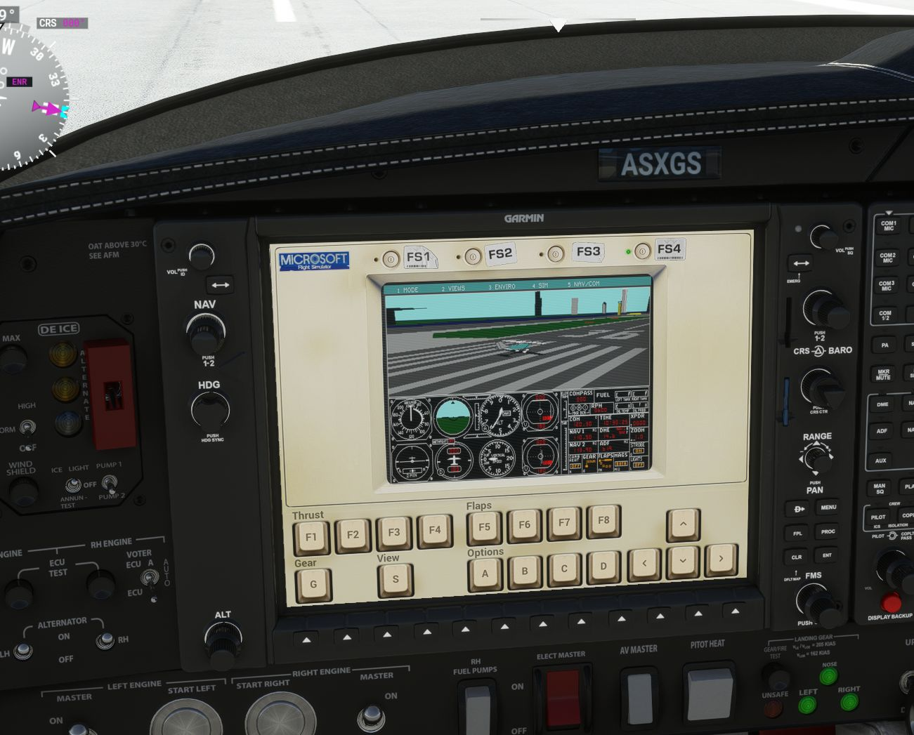

FSHistory
=========

Play and Enjoy the History of Microsoft Flight Simulator

# **[Click to play][project demo]**


Do you know how many Flight Simulators Microsoft published? It has been more than [ten](https://en.wikipedia.org/wiki/Microsoft_Flight_Simulator) with [Microsoft Flight Simulator (2020)](https://de.wikipedia.org/wiki/Microsoft_Flight_Simulator_(2020)) being the latest version that has been released. 

See how it all began. Play the first four flight simulator games from 1982 to 1989 originally developed by Sublogic and Bruce Artwick. It has full mouse and keyboard control and can be even enjoyed on your mobile. However a full IBM style keyboard is recommended.

# Technical aspects

Always when I start a new project I wonder what programming language I should use. Most of the time the requirements are the same. It must be fast, strongly typed and the result must presentable on a website. Especially I would like to keep it as simple as possible. C is usually my language of choice when the logic doesn't get too complicated. And this is exactly the case for such emulators. Low level hardware emulation on a low level language.

C is also the natural choice for WebAssembly as the language features fit perfect. It is like you write an ordinary C-library.

clang of the [LLVM project](https://llvm.org/) offers the ideal compiler infrastructure to create customized WebAssembly files without any additional runtime code. As such my code implements parts of the libc such as printf, malloc and memcpy. Just enough to run the emulator. The result is a project that compiles naturally as a native executable and runs in the browser with just is a few hundred lines of glue code.

In short, this is the technical feature list

 * Developed in C.
 * Emulates an 8086 CPU and features from a 286 and a 386 CPU.
 * Emulates keyboard, mouse, graphics, interrupt controller, timer controller.
 * Implements DOS and BIOS functions similar to [DOSBox](https://www.dosbox.com/).
 * Compiles to an ordinary executable by using the Simple DirectMedia Layer ([SDL](http://www.libsdl.org/)).
 * Compiles to WebAssembly via the LLVM compiler by using my own trivial libc implementation. Zero dependencies. The size of the binary is just 93 kB uncompressed.

## How To Build

To build the native executable make sure gcc and SDL2 is installed and run

```
make
```

To compile the webassembly file install clang and run
```
./scripts/compile_wasm.sh
```

## License

The software part of the repository is under the MIT license. Please read the license file for more information. The game data in the data directory is not part of this license

[project demo]: https://s-macke.github.io/FSHistory/

## Easter Egg in Microsoft Flight Simulator

Code sometimes has the property of duplicating itself and then popup in an unusual place. 
So happened to me when I first heard about an Easter egg in the 40th Anniversary 
Edition of the Flight Simulator. On the runway in a Diamond DA62, you press 
the ELT switch. The screen in front of you changes and offers you to play the first
four DOS Flight Simulator versions.



Could it be, that this is a copy of my project? I downloaded the flight simulator, jumped into the Diamond and pressed the button. And yes, it really is a copy.
I know the quirks of my emulation. 😀

Many thanks to the developer of [Asobo Studio](https://www.asobostudio.com/games/microsoft-flight-simulator) who included this code.
